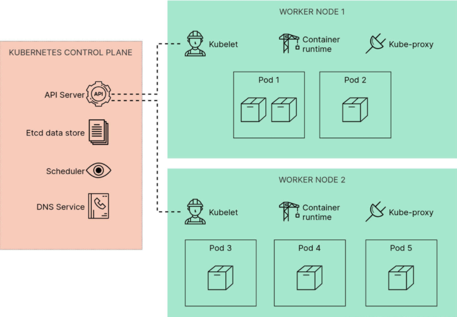

# Abstract

 Kubernetes – A container orchestrator that works with multiple container runtimes, including containerd. Kubernetes is focused on deploying containers in aggregate across one or more physical “nodes.” Historically, Kubernetes was tied to Docker.

## Architecture

### The Control plane

On the left, you’ve got the __control plane__, which lives across multiple nodes.

“Control plane” is a pretty broad term to describe the components that manage the cluster. It includes things like the Kubernetes API Server (which you interact with when you use <backgrd class="rouge">kubectl</backgrd>), and Etcd (which is the data store that holds the desired state of the cluster).

### The nodes

The nodes are the worker machines which run your <keywd class="green">__Pods__</keywd> and their containers. On each node, the <keywd class="green">__Kubelet__</keywd> is a clever daemon that manages the containers running on that node, and reports back their status to the control plane.

You want to learn more about Kubernetes, check out the [__<ins>components page</ins>__](https://kubernetes.io/docs/concepts/overview/components/) on the official Kubernetes on the website.
